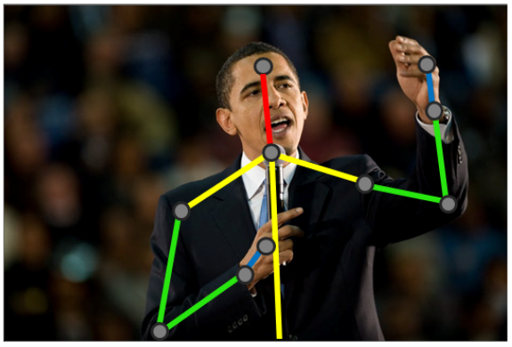

# 1 Computer Vision and Neural Networks
- Start with a brief presentation of the CV field and its history
- Introduce artificial neural networks and explain how they have revolutionized computer vision

## Computer Vision in the Wild
Computer vision can be summarized as the automated extraction of information from digital images The goal of computer vision is to teach computers how to make sense of these pixels the way humans (and other creatures) do, or even better. 
### Main tasks and their applications
- <strong>Object classification</strong>: The task of assigning proper labels (or classes) to images among a predefined set. Object classification became famous for being the first success story of deep convolutional neural networks being applied to computer vision back in 2012. Common applications are text digitization (using character recognition) and the automatic annotation of image databases. Covered in <strong>Chapter 4</strong>.

- <strong>Object identification</strong>: Object identification (or instance classification) methods learn to recognize specific instances of a class. For example, an identification method would focus on the face's features to identify the person and recognize them in other images. Therefore, object identification can be seen as a procedure to cluster a dataset. Covered in <strong>Chapter 6</strong>.

- <strong>Object detection and localization</strong>: Another task is the detection of specific elements in an image. It is commonly applied to face detection for surveillance applications or even advanced camera apps, the detection of cancerous cells in medicine, the detection of damaged components in industrial plants, and so on. Detection is often a preliminary step before further computations, providing smaller patches of the image to be analyzed separately. Covered in <strong>Chapter 5</strong>.

- <strong>Object and instance segmentation</strong>: Segmentation can be seen as a more advanced type of detection. Instead of simply providing bounding boxes for the recognized elements, segmentation methods return masks labeling all the pixels belonging to a specific class or to a specific instance of a class. This makes the task much more complex, and actually one of the few in computer vision where deep neural networks are still far from human performance. Covered in <strong>Chapter 6</strong>.

- <strong>Pose estimation</strong>: Pose estimation can have different meanings depending on the targeted tasks. For rigid objects, it usually means the estimation of the objects' positions and orientations relative to the camera in the 3D space. For non-rigid elements, pose estimation can also mean the estimation of the positions of their sub-parts relative to each other.

- <strong>Video analysis</strong>: Computer vision not only applies to single images, but also to videos. If video streams are sometimes analyzed frame by frame, some tasks require that you consider an image sequence as a whole in order to take temporal consistency into account. Covered in <strong>Chapter 8</strong>.

- <strong>Instance tracking</strong>: Tracking is, localizing specific elements in a video stream. Tracking could be done frame by frame by applying detection and identification methods to each frame. However, it is much more efficient to use previous results to model the motion of the instances in order to partially predict their locations in future frames.

- <strong>Action recognition</strong>: Action recognition belongs to the list of tasks that can only be run with a sequence of images. Recognizing an action means recognizing a particular motion among a predefined set. Applications range from surveillance to human-machine interactions.

- <strong>Motion estimation</strong>: Instead of trying to recognize moving elements, some methods focus on estimating the actual velocity/trajectory that is captured in videos. It is also common to evaluate the motion of the camera itself relative to the represented scene (egomotion). This is particularly useful in the entertainment industry, for example, to capture motion in order to apply visual effects or to overlay 3D information in TV streams such as sports broadcasting.

- <strong>Content-aware image edition</strong>: Besides the analysis of their content, computer vision methods can also be applied to improve the images themselves. More and more, basic image processing tools (such as low-pass filters for image denoising) are being replaced by smarter methods that are able to use prior knowledge of the image content to improve its visual quality. Covered in <strong>Chapters 6 and 7</strong>

- <strong>Scene reconstruction</strong>: Scene reconstruction is the task of recovering the 3D geometry of a scene, given one or more images. Advanced methods take several images and match their content together in order to obtain a 3D model of the target scene. This can be applied to the 3D scanning of objects, people, buildings, and so on.

## A brief history of computer vision
In order to better understand the current stand of the heart and current challenges of computer vision, we suggest that we quickly have a look at where it came from and how it has evolved in the past decades.

- Computer vision as a domain started as early as the 60s, a time when they underestimated the complexity of lower animal functions such as <strong>perception</strong>. How these researchers believed they could reproduce human perception through a single summer project in 1966 is a famous anecdote in the computer vision community.

- Marvin Minsky was one of the first to outline an approach toward building AI systems based on perception. He argued that with the use of lower functions such as pattern recognition, learning, planning, and induction, it could be possible to build machines capable of solving a broad variety of problems. However, this theory was only properly explored from the 80s onward.

- Inspired by human perception, the basic mechanisms of computer vision are straightforward and have not evolved much since the early years—the idea is to first extract meaningful features from the raw pixels, and then match these features to known, labeled ones in order to achieve recognition. Researchers used to come up with more and more complex features. The extraction of edges and lines was first considered for the basic geometrical understanding of scenes or for character recognition; then, texture and lighting information was also taken into account, leading to early object classifiers. <strong>Note</strong>: In computer vision, a feature is a piece of information (often mathematically represented as a one or two-dimensional vector) that is extracted from data that is relevant to the task at hand.

- In the 90s, features based on statistical analysis, such as principal component analysis (PCA), were successfully applied for the first time to complex recognition problems such as face classification.

- Another method that appeared in the late 90s and revolutionized the domain is called Scale Invariant Feature Transform (SIFT). As its name suggests, this method represents visual objects by a set of features that are robust to changes in scale and orientation. In the simplest terms, this method looks for some key points in images (searching for discontinuities in their gradient), extracts a patch around each key point, and computes a feature vector for each.

- It soon appeared clear, however, that extracting robust, discriminative features was only half the job for recognition tasks. For instance, different elements from the same class can look quite different (such as different-looking dogs) and, as a result, share only a small set of common features. Therefore, unlike image-matching tasks, higher-level problems such as semantic classification cannot be solved by simply comparing pixel features from query images with those from labeled pictures. 

- This is where machine learning comes into play. In the 90s, more statistical ways to discriminate images based on their features started to appear. These machine learning algorithms were adapted over the years by the computer vision community, including SVMs, random forests, bags of words, Bayesian models, and obviously neural networks.

- Early deep learning actually came before these computer vision techniques, but their development is the typical story of an invention too early for its time.

- In the 50s, Frank Rosenblatt came up with the perceptron, a machine learning algorithm inspired by neurons and the underlying block of the first neural networks. This method was already able to recognize characters. However, the hype was short-lived. It was quickly demonstrated that the perceptron could not learn a function as simple as XOR. 

- It was only in the late 70s to early 80s that neural networks got some attention put back on them. Several research papers introduced how neural networks, with multiple layers of perceptrons put one after the other, could be trained using a rather straightforward scheme—backpropagation. Soon after, the first convolutional neural network (CNN). was developed and applied to the recognition of handwritten characters with some success. However, these methods were computationally heavy, and just could not scale to larger problems. Instead, researchers adopted lighter machine learning methods such as SVMs, and the use of neural networks stalled for another decade.

- <strong>The roots of the comeback of deep learning is twofold and rooted in the explosive evolution of the internet and hardware efficiency.</strong> 

- The internet was not only a revolution in communication; it also deeply transformed data science. It became much easier for scientists to share images and content by uploading them online, leading to the creation of public datasets for experimentation and benchmarking. Moreover, not only researchers but soon everyone, all over the world, started adding new content online, sharing images, videos, and more at an exponential rate. This started big data and the golden age of data science, with the internet as the new El Dorado.

- By simply indexing the content that is constantly published online, image and video datasets reached sizes that were never imagined before, from Caltech-101 (10,000 images, published in 2003 by Li Fei-Fei et al., Elsevier) to ImageNet (14+ million images, published in 2009 by Jia Deng et al., IEEE) or Youtube-8M (8+ million videos, published in 2016 by Sami Abu-El-Haija et al., including Google). With so much data available covering so many use cases, new doors were opened (data-hungry algorithms).

- As the internet was booming, so was computing power. Hardware kept becoming cheaper as well as faster. As computers got faster, they also became better designed for deep learning. And for this, we have to thank video games. The graphical processing unit (GPU) is a computer component, that is, a chip specifically designed to handle the kind of operations needed to run 3D games. Therefore, a GPU is optimized to generate or manipulate images, parallelizing these heavy matrix operations. In 2007, NVIDIA, one of the main companies designing GPUs, released the first version of CUDA, a programming language that allows developers to directly program for compatible GPUs. With these new tools, people started to harness the power of GPUs for new tasks, such as machine learning and computer vision.

- <strong>The conditions were finally there for data-hungry, computationally-intensive algorithms to shine. Along with big data and cloud computing, deep learning was suddenly everywhere.</strong>

- Deep learning really started being used from 2006, when Geoff Hinton and his colleagues proposed an effective solution to train these deeper models, one layer at a time, until reaching the desired depth (A Fast Learning Algorithm for Deep Belief Nets, MIT Press, 2006).

- With research into neural networks once again back on track, deep learning started growing, until a major breakthrough in 2012 (from the ImageNet competition) finally gave it its contemporary prominence. The winning solutions in 2010 and 2011 had classification errors of 28% and 26% respectively, and applied traditional concepts such as SIFT features and SVMs. Then came the 2012 edition, and a new team of researchers reduced the recognition error to a staggering 16%, leaving all the other contestants far behind. In their paper describing this achievement, Alex Krizhevsky, Ilya Sutskever, and Geoff Hinton presented what would become the basis for modern recognition methods. They conceived an 8-layer neural network, later named AlexNet, with several convolutional layers and other modern components such as dropout and rectified linear activation units (ReLUs). More importantly, they used CUDA to implement their method so that it can be run on GPUs, finally making it possible to train deep neural networks in a reasonable time, iterating over datasets as big as ImageNet.

- That same year, Google demonstrated how advances in cloud computing could also be applied to computer vision. Using a dataset of 10 million random images extracted from YouTube videos, they taught a neural network to identify images containing cats and parallelized the training process over 16,000 machines to finally double the accuracy compared to previous methods.

- And so started the deep learning era we are currently in. Everyone jumped on board, coming up with deeper and deeper models, more advanced training schemes, and lighter solutions for portable devices. 

