# TensorFlow Basics and Training a Model
-  While you can perform any numerical operation with TensorFlow, it is mostly used to train and run deep neural networks.
- This chapter will introduce you to the core concepts of TensorFlow 2 and walk you through a simple example.

## TensorFlow APIs
TensorFlow's architecture has several levels of abstraction.

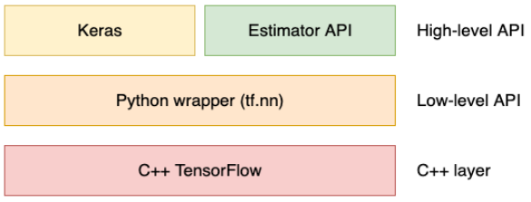

Let's first introduce the lowest layer and find our way to the uppermost layer.

- Most deep learning computations are coded in C++. To run operations on the GPU, TensorFlow uses a library developed by NVIDIA called CUDA. This is the reason you need to install CUDA if you want to exploit GPU capabilities and why you cannot use GPUs from another hardware manufacturer.

- The Python low-level API then wraps the C++ sources. When you call a Python method in TensorFlow, it usually invokes C++ code behind the scenes. This wrapper layer allows users to work more quickly because Python is considered easier to use than C++ and does not require compilation. This Python wrapper makes it possible to perform extremely basic operations such as matrix multiplication and addition.

- At the top sits the high-level API, made of two components—Keras and the Estimator API. Keras is a user-friendly, modular, and extensible wrapper for TensorFlow. We will introduce it in the next section. The Estimator API contains several pre-made components that allow you to build your machine learning model easily. You can consider them building blocks or templates.

## Introducing Keras
- First released in 2015, Keras was designed as an interface to enable fast experimentation with neural networks. As such, it relied on TensorFlow or Theano to run deep learning operations.

- Since 2017, TensorFlow has integrated Keras fully, meaning that you can use it without installing anything other than TensorFlow. Throughout this book, we will rely on tf.keras instead of the standalone version of Keras.

- We can now move on to building the actual model. We will use a very simple architecture composed of two fully connected (also called dense) layers:

    - <strong>Flatten</strong>: This will take the 2D matrix representing the image pixels and turn it into a 1D array. We need to do this before adding a fully connected layer. The 28 × 28 images are turned into a vector of size 784.
    - <strong>Dense</strong> of size 128: This will turn the 784 pixel values into 128 activations using a weight matrix of size 128 × 784 and a bias matrix of size 128. In total, this means 100,480 parameters.
    - <strong>Dense</strong> of size 10: This will turn the 128 activations into our final prediction. Notice that because we want probabilities to sum to 1, we will use the softmax activation function.

## Tensorflow 2 and Keras in Detail
We have introduced the general architecture of TensorFlow and trained our first model using Keras. Let's now walk through the main concepts of TensorFlow 2.

#### Tensors: 
- You can imagine tensors as N-dimensional arrays. A tensor could be a scalar, a vector, a 3D matrix, or an N-dimensional matrix. 
- A fundamental component of TensorFlow, the Tensor object is used to store mathematical values. It can contain fixed values (created using <em>tf.constant</em>) or changing values (created using <em>tf.Variable</em>).
- Each Tensor object has the following:
    - Type: string, float32, float16, or int8, among others.
    - Shape: The dimensions of the data. For instance, the shape would be () for a scalar, (n) for a vector of size n, and (n, m) for a 2D matrix of size n × m.
    - Rank: The number of dimensions, 0 for a scalar, 1 for a vector, and 2 for a 2D matrix.
- Some tensors can have partially unknown shapes. For instance, a model accepting images of variable sizes could have an input shape of (None, None, 3). Since the height and the width of the images are not known in advance, the first two dimensions are set to None. However, the number of channels (3, corresponding to red, blue, and green) is known and is therefore set.
- TensorFlow uses tensors as inputs as well as outputs.

#### Graphs:
- A component that transforms input into output is called an operation. A computer vision model is therefore composed of multiple operations.
- TensorFlow represents these operations using a directed acyclic graph (DAC), also referred to as a graph. 
- When building the previous example using Keras, TensorFlow actually built a graph:

    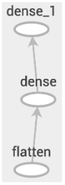
- While very simple, this graph represents the different layers of our model in the form of operations. Relying on graphs has many advantages, allowing TensorFlow to do the following:
    - Run part of the operations on the CPU and another part on the GPU
    - Run different parts of the graph on different machines in the case of a distributed model
    - Optimize the graph to avoid unnecessary operations, leading to better computational performance
    - Moreover, the graph concept allows TensorFlow models to be portable. A single graph definition can be run on any kind of device.
- In TensorFlow 2, graph creation is no longer handled by the user. While managing graphs used to be a complex task in TensorFlow 1, the new version greatly improves usability while still maintaining performance.

#### Lazy execution vs eager execution
The main change in TensorFlow 2 is eager execution. Historically, TensorFlow 1 always used lazy execution by default. It is called lazy because operations are not run by the framework until asked specifically to do so.

Example:
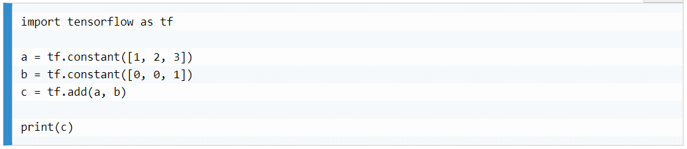

The output depends on the TensorFlow version. With TensorFlow 1 (where lazy execution is the default mode), the output would be this:

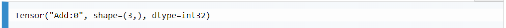

However, with TensorFlow 2 (where eager execution is the default mode), you would get the following output:

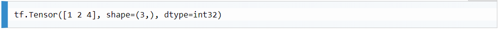

In both cases, the output is a Tensor. In the second case, the operation has been run eagerly and we can observe directly that the Tensor contains the result ([1 2 4]). In the first case, the Tensor contains information about the addition operation (Add:0), but not the result of the operation.

<strong>Note</strong>: In eager mode, you can access the value of a Tensor by calling the .numpy() method. In our example, calling c.numpy() returns [1 2 4] (as a NumPy array).

#### Creating graphs
Using lazy execution, TensorFlow would create a graph of operations. Before running the graph to get the result, a graph optimizer would be run. For example, to avoid dumplicate computations, the optimizer can cache results and reuse them when necessary. For more complex operations, the optimizer could enable parallelism to make computation faster. Both techniques are important when running large and complex models.

However, running in eager mode  implies that every operation is run when defined. Therefore, such optimizations cannot be applied. Thankfully, TensorFlow includes a module to work around this—TensorFlow <strong>AutoGraph</strong>.

The TensorFlow AutoGraph module makes it easy to turn eager code into a graph, allowing automatic optimization. To do so, the easiest way is to add the tf.function decorator on top of your function:

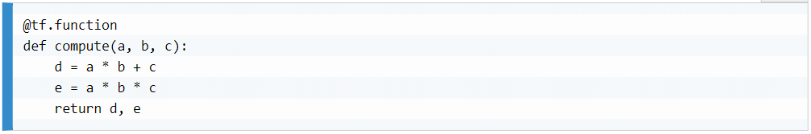

Note: A Python <strong>decorator</strong> is a concept that allows functions to be wrapped, adding functionalities or altering them. Decorators start with an @ (the "at" symbol).

Now, when we call the compute function for the first time, TensorFlow will transparently create the following graph:

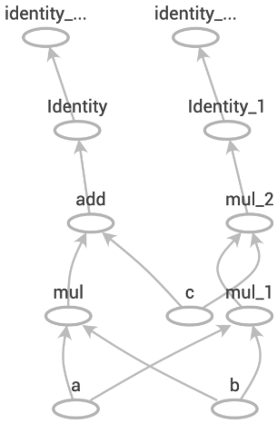

TensorFlow AutoGraph can convert most Python statements, such as for loops, while loops, if statements, and iterations. Thanks to graph optimizations, graph execution can sometimes be faster than eager code. More generally, AutoGraph should be used in the following scenarios:

- When the model needs to be exported to other devices
- When performance is paramount and graph optimizations can lead to speed improvements

Another advantage of graphs is their automatic differentiation. Knowing the full list of operations, TensorFlow can easily compute the gradient for each variable.

#### Backrpopogation using the gradient tape
For innovative models or when experimenting, the gradient tape is a powerful tool that allows automatic differentiation without much effort.

However, we don't need to really know how to use it when working with the Keras API because Keras models encapsulate training inside the .fit() function, so there's no need to update the variables manually.

I can come back to this section in the book if/when this becomes relevant to me.

#### Keras models and layers
In the first section of this chapter, we built a simple Keras model. The resulting Model object contains numerous useful methods and properties:
- <em>.inputs</em> and <em>.outputs</em>: Provide access to the inputs and outputs of the model.
- <em>.layers</em>: Lists the model's layers as well as their shape.
- <em>.summary()</em>: Prints the architecture of the model.
- <em>.save()</em>: Saves the model, its architecture, and the current state of training. It is very useful for resuming training later on. Models can be instantiated from a file using tf.keras.models.load_model().
- <em>.save_weights()</em>: Only saves the weights of the model.

#### Sequential and functional APIs
The functional API is much more versatile and expressive than the Sequential API. The former allows for branching models (that is, for building architectures with multiple parallel layers for instance), while the latter can only be used for linear models. 

For even more flexibility, Keras also offers the possibility to subclass the Model class, as described in Chapter 3, Modern Neural Networks.

Regardless of how a Model object is built, it is composed of layers. A layer can be seen as a node that accepts one or several inputs and returns one or several outputs, similar to a TensorFlow operation. Its weights can be accessed using .get_weights() and set using .set_weights(). Keras provides pre-made layers for the most common deep learning operations. For more innovative or complex models, tf.keras.layers.Layer can also be subclassed.

#### Callbacks
Keras callbacks are utility functions that you can pass to a Keras model's .fit() method to add functionality to its default behavior. Multiple callbacks can be defined, which will be called by Keras either before or after each batch iteration, each epoch, or the whole training procedure. Predefined Keras callbacks include the following:
- <em>CSVLogger</em>: Logs training information in a CSV file.
- <em>EarlyStopping</em>: Stops training if the loss or a metric stops improving. It can be useful in avoiding overfitting.
- <em>LearningRateScheduler</em>: Changes the learning rate on each epoch according to a schedule.
- <em>ReduceLROnPlateau</em>: Automatically reduces the learning rate when the loss or a metric stops improving.

It is also possible to create custom callbacks by subclassing <em>tf.keras.callbacks.Callback</em>.

#### How tf.function works
As mentioned earlier, when calling a function decorated with tf.function for the first time, TensorFlow will create a graph corresponding to the function's operations. TensorFlow will then cache the graph so that the next time the function is called, graph creation will not be necessary.

TensorFlow graphs are defined by their operations and the shapes and types of the tensors they receive as inputs. Therefore, when the input type changes, a new graph needs to be created. In TensorFlow vocabulary, when a tf.function function has defined input types, it becomes a concrete function.

To summarize, every time a decorated function is run for the first time, TensorFlow caches the graph corresponding to the input types and input shapes. If the function is run with inputs of a different type, TensorFlow will create a new graph and cache it.

#### Variables in TensorFlow 2
To hold the model weights, TensorFlow uses <em>Variable</em> instances.

In our example, variable management (including naming) has been entirely handled by Keras. However, it is also possible to create our own variables:

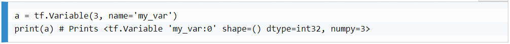

Note that for large projects, it is recommended to name variables to clarify the code and ease debugging. To change the value of a variable, use the <em>Variable.assign</em> method. Failing to use the <em>.assign()</em> method would create a new Tensor method.

Finally, deleting the Python reference to a variable will remove the object itself from the active memory, releasing space for other variables to be created.

#### Using the Estimator API
The Estimator API is a high-level alternative to the Keras API. Estimators simplify training, evaluation, prediction, and serving.

There are two types of Estimators. Pre-made Estimators are very simple models provided by TensorFlow, allowing you to quickly try out machine learning architectures. The second type is custom Estimators, which can be created using any model architecture.

Estimators handle all the small details of a model's life cycle—data queues, exception handling, recovering from failure, periodic checkpoints, and many more. While using Estimators was considered best practice in TensorFlow 1, in version 2, it is recommended to use the Keras API.

Pre-made Estimators are suitable for some machine learning problems. However, they are not suitable for computer vision problems, as there are no pre-made Estimators with convolutions, a powerful type of layer described in the next chapter.

#### Training a custom Estimator
The easiest way to create an Estimator is to convert a Keras model. After the model has been compiled, call <em>tf.keras.estimator.model_to_estimator()</em>:

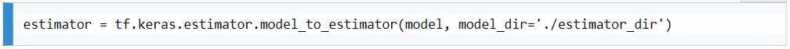

The <em>model_dir</em> argument allows you to specify a location where the checkpoints of the model will be saved. As mentioned earlier, Estimators will automatically save checkpoints for our models.

Training an Estimator requires the use of an input function—a function that returns data in a specific format. One of the accepted formats is a TensorFlow dataset. The dataset API is described in depth in Chapter 7. For now, we'll define the following function, which returns the dataset defined in the first part of this chapter in the correct format, in batches of 32 samples:

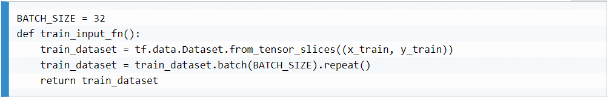

Once this function is defined, we can launch the training with the Estimator:

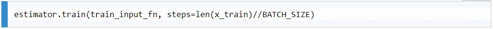

Just like Keras, the training part is very simple, as Estimators handle the heavy lifting.

## TensorFlow Ecosystem
In addition to the main library, TensorFlow offers numerous tools that are useful for machine learning. While some of them are shipped with TensorFlow, others are grouped under TensorFlow Extended (TFX) and TensorFlow Addons.

#### TensorBoard
TensorFlow provides a powerful tool for monitoring—TensorBoard. Installed by default with TensorFlow, it is also very easy to use when combined with Keras's callbacks.

By default, TensorFlow will automatically write the loss and the metrics to the folder we specified. We can then launch TensorBoard from the command line. 

As you will see in this book, training a deep learning model requires a lot of fine-tuning. Therefore, it is essential to monitor how your model is performing. TensorBoard allows you to do precisely this. The most common use case is to monitor the evolution of the loss of your model over time. But you can also do the following:
- Plot any metric (such as accuracy)
- Display input and output images
- Display the execution time
- Draw your model's graph representation

<strong>This section in the book covers more about TensorBoard so I can get into it when I want to know more.</strong>

#### TensorFlow Addons and TensorFlow Extended
<em>TensorFlow Addons</em> is a collection of extra functionalities gathered into a single repository (https://www.tensorflow.org/addons). It hosts some of the newer advancements in deep learning that are too unstable or not used by enough people to justify adding them to the main TensorFlow library. It also acts as a replacement for tf.contrib, which was removed from TensorFlow 1.

<em>TensorFlow Extended</em> is an end-to-end machine learning platform for TensorFlow. It offers several useful tools:
- TensorFlow Data Validation: A library for exploring and validating machine learning data. You can use it before even building your model.
- TensorFlow Transform: A library for preprocessing data. It allows you to make sure training and evaluation data are processed the same way.
- TensorFlow Model Analysis: A library for evaluating TensorFlow models.
- TensorFlow Serving: A serving system for machine learning models. Serving is the process of delivering predictions from a model, usually through a REST API.

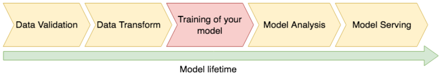

More info at: https://www.tensorflow.org/tfx

#### TensorFlow Lite and TensorFlow.js
The main version of TensorFlow is designed for Windows, Linux, and Mac computers. TensorFlow Lite is designed to run model predictions (inference) on mobile phones and embedded devices. TensorFlow.js (also referred to as tfjs) was developed to empower almost any web browser with deep learning.

