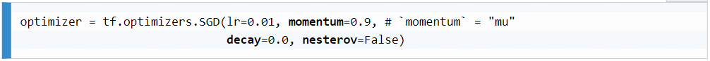
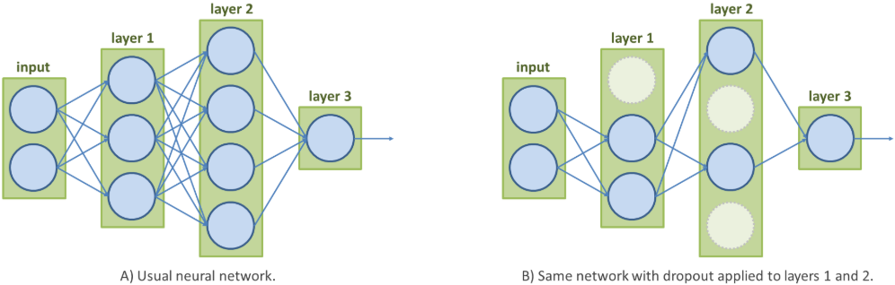

# Modern Neural Networks
## Convolutional Neural Networks
CNNs were introduced to solve some of the shortcomings of the original neural networks. In this section, we will address these issues and present how CNNs deal with them.

#### Problems with fully connected networks
We have already highlighted the following two main drawbacks of basic networks when dealing with images:
- <strong>An explosive number of parameters</strong>: Images are complex structures with a large number of values. Even the small, single-channel images of the MINST dataset represent input vectors of 784 values each. For the first layer of the basic neural network we implemented, this meant a weight matrix of shape (784, 64). This equates to 50,176 (784 × 64) parameter values to optimize, just for this variable! This number of parameters simply explodes when we consider larger RGB images or deeper networks.

- <strong>A lack of spatial reasoning</strong>: Because their neurons receive all the values from the previous layer without any distinction (they are fully connected), these neural networks do not have a notion of distance/spatiality. Spatial relations in the data are lost. More precisely, this means that the notion of proximity between pixels is lost to fully connected (FC) layers, as all pixel values are combined by the layers with no regard for their original positions. Intuitively, neural layers would be much smarter if they could take into account spatial information.

#### Introducing CNNs
First of all, CNNs can handle multidimensional data. For images, a CNN takes as input three-dimensional data (height × width × depth) and has its own neurons arranged in a similar volume. 

This leads to the second novelty of CNNs—unlike fully connected networks, where neurons are connected to all elements from the previous layer, each neuron in CNNs only has access to some elements in the neighboring region of the previous layer. This region is called the receptive field of the neurons (or the filter size).

By linking neurons only to their neighboring ones in the previous layer, CNNs not only drastically reduce the number of parameters to train, but also preserve the localization of image features.

#### Convolution layers
In these layers, the number of parameters is further reduced by sharing the same weights and bias among all neurons connected to the same output channel. 

These specific neurons with shared weights and bias can also be thought of as a single neuron sliding over the whole input matrix with spatially limited connectivity. At each step, this neuron is only spatially connected to the local region in the input volume (H × W × D) it is currently sliding over. Given this limited input of dimensions, the neuron still works like the ones modeled in our first chapter—it linearly combines the input values before applying an activation function to the sum (a linear or non-linear function).

Therefore, the results of a convolution are indeed obtained by sliding a filter, w, over the input matrix, x, and computing, at each position, the dot product of the filter and the patch of x starting at the current position.

Note: the input, x, has been padded with zeros, which is commonly done in convolutional layers.

A convolutional layer with N sets of different neurons is thus defined by N weight matrices (also called filters or kernels) of shape D × k × k (when the filters are square), and N bias values. Therefore, this layer only has N × (Dk2 + 1) values to train - significantly less tan the number of trainable parameters of fully connected layers. i.e. FC layers are influenced by the dimensionality of the data, whereas CNNs are not. 

This property makes convolutional layers really powerful tools in computer vision for two reasons:
- We can train networks for larger input images without impacting the number of parameters we would need to tune. 
- Convolutional layers can be applied to any images, irrespective of their dimensions! Unlike networks with fully connected layers, purely convolutional ones do not need to be adapted and retrained for inputs of different sizes. 

Other interesting properties of convolutional layers include:
- The layer's filters become really good at reacting to specific local features (a layer with N filters means the possibility to react to N different features). Each kernel of the first convolutional layer in a CNN would, for instance, learn to activate for a specific low-level feature, such as a specific line orientation or color gradient. Then, deeper layers would use these results to localize more abstract/advanced features, such as the shape of a face, and the contours of a particular object. 
- Each filter would respond to a specific image feature, whatever its location(s) in the image. More formally, convolutional layers are invariant to translation in the image coordinate space.

Concolutional layer hyperparameters:
- Number of filters, N
- Input depth, D
- Filter/kernel size (kH, kW). As square filters are commonly used, the size is usually simply defined by k.
- Stride: Defines whether the dot product between the image patches and the filters should be computed at every position when sliding (stride = 1), or every s position (stride = s). The larger the stride, the sparser the resulting feature maps.
- Padding: Images can also be zero-padded before convolution; that is, their sizes can be synthetically increased by adding rows and columns of zeros around their original content.

All these parameters not only affect the layer's operations, but also its output shape. As such, with these hyperparameters, we can easily control the layer's output sizes. This is particularly convenient for applications such as object segmentation; that is, when we want the output segmentation mask to be the same size as the input image.

the Keras API encapsulates the initialization of CNNs in the <em>tf.keras.layers</em> module. We can instantiate a similar convolutional layer in a single call, as follows:

The documentation has a long list of additional parameters, encapsulating several concepts, such as weight regularization.

#### Pooling layers 
These pooling layers are a bit peculiar because they do not have any trainable parameters. Each neuron simply takes the values in its window (the receptive field) and returns a single output, computed from a predefined function.

Pooling layers are commonly used with a stride value equal to the size of their window/kernel size, in order to apply the pooling function over non-overlapping patches. Their purpose is to reduce the spatial dimensionality of the data, cutting down the total number of parameters needed in the network, as well as its computation time. Also, as with convolutional layers, you can pad the tensors before applying the operation. Through the padding and stride parameters, it is thus possible to control the dimensions of the resulting tensors.

The two most common pooling methods are max-pooling and average-pooling. <em>Max-pooling</em> layers return only the maximum value at each depth of the pooled area, and <em>average-pooling</em> layers compute the average at each depth of the pooled area.

Max pooling:

With hyperparameters being similar to convolutional layers except for the absence of trainable kernels, pooling layers are, therefore, easy to use and lightweight solutions for controlling data dimensionality. An example of average pooling:

We can instantiate pooling layers in TensorFlow via <em>tf.keras.layers.AvgPool2D</em>:

#### Fully connected layers

FC layers are also used in CNNs, the same way they are in regular networks. However, the input tensors passed to these layers must first be reshaped into a batched column vector — the way we did with the MNIST images for our simple network in Chapter 1.

While it can be advantageous in some cases for neurons to have access to the complete input map, fully connected layers have several shortcomings (for example, the loss of spatial information and the large number of parameters). Moreover, unlike other CNN layers, dense ones are defined by their input and output sizes. A specific dense layer will not work for inputs that have a shape different from the one it was configured for. Therefore, using FC layers in a neural network usually means losing the possibility to apply them to images of heterogeneous sizes.

Despite these shortcomings, these layers are still commonly used in CNNs. They are usually found among the final layers of a network, for instance, to convert the multidimensional features into a 1D classification vector.

Remember that you should, however, take care of flattening the multidimensional tensors before passing them to dense layers. <em>tf.keras.layers.Flatten()</em> can be used as an intermediate layer for that purpose.

#### Effective receptive field
The effective receptive field (ERF) of a neural network is an important notion in deep learning, as it may affect the ability of the network to cross-reference and combine distant elements in the input images.

While the receptive field represents the local region of the previous layer that a neuron is connected to, the ERF defines the region of the input image (and not just of the previous layer), which affects the activation of a neuron for a given layer.

The ERF of a network is directly affected by the number of intermediary layers, their filter sizes, and the strides. Subsampling layers, such as pooling layers or layers with larger strides, greatly increase the ERF at the cost of lower feature resolution.

<strong>Because of the local connectivity of CNNs, you should keep in mind how layers and their hyperparameters will affect the flow of visual information across the networks when defining their architecture.</strong>

## Refining the Training Process
Network architectures are not the only things to have improved over the years. The way that networks are trained has also evolved, improving how reliably and quickly they can converge. In this section, we will tackle some of the shortcomings of the gradient descent algorithm, Computer Vision and Neural Networks, as well as some ways to avoid overfitting.

#### Gradient descent challenges
As we know, the parameters of a neural network can be iteratively updated during training to minimize the loss, L, backpropagating its gradient. 

A very important hyperparameter is the <strong>learning rate</strong>. There are three reasons great care needs to be taking in picking a learning rate:

1) <strong>Training velocity vs model performance</strong>: While setting a high learning rate may allow the trained network to converge faster, it also may prevent the network from finding a proper loss minimum.

    Intuitively, there should be a better solution than trial and error to find the proper learning rate. For instance, a popular solution is to dynamically adjust the learning rate during training, starting with a larger value and decreasing it after every epoch. This process is named learning rate decay. Manual decaying can still be found in many implementations, though, nowadays, TensorFlow offers more advanced learning rate schedulers and optimizers with adaptive learning rates.

2) <strong>Suboptimal local minima</strong>: A common problem when optimizing complex methods is getting stuck in suboptimal local minima. Indeed, gradient descent may lead us to a local minimum it cannot escape, even though a better minimum lies close by.

    Indeed, the gradient descent process cannot ensure the convergence to a global minimum. But, given the complexity of visual tasks and the large number of parameters needed to tackle them, data scientists are usually glad to just find a satisfying local minimum.
    
    One possible mitigation is to use SGD; because of the random sampling of training samples (causing the gradients to often differ from one mini-batch to another), the SGD algorithm is already able to jump out of shallow local minima.

3) <strong>A single hyperparameter for heterogeneous parameters</strong>: That is, the same learning rate is used to update all the parameters of the network. However, not all these variables have the same sensitivity to changes, nor do they all impact the loss at every iteration.

    It may seem beneficial to have different learning rates to update crucial parameters more carefully, and to more boldly update parameters that are not contributing often enough to the network's predictions.

#### Advanced optimizers
Some of the intuitions we presented in the previous paragraphs have been properly studied and formalized by researchers, leading to new optimization algorithms based on SGD. The most common ones include:

- <strong>Momentum algorithms</strong>: The momentum algorithm is based on SGD and inspired by the physics notion of momentum—as long as an object is moving downhill, its speed will increase with each step. Applied to gradient descent, the idea is to take previous parameter updates, vi-1, into account, adding them to the new update terms. If the current and previous steps have the same direction, their magnitudes will add up, accelerating the SGD in this relevant direction. If they have different directions, the momentum will dampen these oscillations. In <em>tf.optimizers</em>, momentum is defined as an optional parameter of SGD:

    

    This optimizer instance can then be directly passed as a parameter to model.fit() when launching the training through the Keras API. 
    
    This SGD API has one interesting Boolean parameter—to switch from the common momentum method to Nesterov's algorithm. Indeed, a major problem of the former method is that by the time the network gets really close to its loss minimum, the accumulated momentum will usually be quite high, which may cause the method to miss or oscillate around the target minimum.

    The Nesterov accelerated gradient (NAG or Nesterov momentum) offers a solution to this problem. Yurii Nesterov's idea was to give the optimizer the possibility to have a look at the slope ahead so that it knows it should slow down if the slope starts going up. More formally, Nesterov suggested directly reusing the past term to estimate which values the parameters would take if we keep following this direction. The gradient is then evaluated with respect to those approximate future parameters, and it is used to finally compute the actual update. 

    This version of the momentum optimizer is more adaptable to gradient changes, and can significantly speed up the gradient descent process.

- <strong>The Ada family</strong>: <em>Adagrad</em>, <em>Adadelta</em>, and <em>Adam</em> are several iterations and variations around the idea of adapting the learning rate depending on the sensitivity and/or activation frequency of each neuron. 

    The </em>Adagrad</em> optimizer uses a neat formula to automatically decrease the learning rate more quickly for parameters linked to commonly found features, and more slowly for infrequent ones. In other words, the more updates a parameter receives, the smaller the updates. This optimization algorithm not only removes the need to manually adapt/decay the learning rate, but it also makes the SGD process more stable, especially for datasets with sparse representations.

    The <em>Adadelta</em> optimizer offered a solution to one problem inherent to Adagrad. As it keeps decaying the learning rate every iteration, at some point, the learning rate becomes too small and the network just cannot learn anymore (except maybe for infrequent parameters). Adadelta avoids this problem by keeping in check the factors used to divide the learning rate for each parameter.

    The <em>Adam</em> optimizer is another iteration, that in addition to storing previous update terms to adapt the learning rate for each parameter, Adam also keeps track of the past momentum values. It is, therefore, often identified as a mix between Adadelta and momentum.

Note that there is no consensus regarding which of these optimizers may be the best. Adam is, however, preferred by many computer vision professionals for its effectiveness on scarce data. <strong>RMSprop</strong> is also often considered a good choice for recurrent neural networks. RMSprop is similar to Adelta, and was also developed to correct Adagrad's flaw

#### Regularization methods
Efficiently teaching neural networks so that they minimize the loss over training data is, however, not enough. We also need to make sure that the model does not overfit our training set (so it can generalize well to new, unseen data).

For our networks to generalize well, we mentioned that rich training sets (with enough variability to cover possible testing scenarios) and well-defined architectures (neither too shallow to avoid underfitting, nor too complex to prevent overfitting) are key. However, other methods have been developed over the years for regularization:

- <strong>Early stopping</strong>: Neural networks start overfitting when they iterate too many times over the same small set of training samples. Therefore, a straightforward solution to prevent this problem is to figure out the number of training epochs a model needs. The number should be low enough to stop before the network starts overfitting, but still high enough for the network to learn all it can from this training set.

- <strong>L1 and L2 regularization</strong>: Prevents overfitting by modifying the loss in order to include regularization as one of the training objectives. The L1 and L2 regularizers are prime examples of this.

    L2 regularization (also called ridge regularization) compels the network to minimize the sum of its squared parameter values. While this regularization leads to the decay of all parameter values over the optimization process, it more strongly punishes large parameters due to the squared term. Therefore, L2 regularization encourages the network to keep its parameter values low and thus more homogeneously distributed. It prevents the network from developing a small set of parameters with large values influencing its predictions (as it may prevent the network from generalizing).

    On the other hand, the L1 regularizer compels the network to minimize the sum of its absolute parameter values. The difference between this and L2 regularization may seem symbolic at first glance, but their properties are actually quite different. As larger weights are not penalized by squaring, L1 regularization instead makes the network shrink the parameters linked to less important features toward zero. Therefore, it prevents overfitting by forcing the network to ignore less meaningful features. In other words, L1 regularization forces the network to adopt sparse parameters; that is, to rely on a smaller set of non-null parameters. This can be advantageous if the footprint of the network should be minimized (for mobile applications, for example).

- <strong>Dropout</strong>: So far, the regularization methods we have covered are affecting the way networks are trained. Other solutions are affecting their architecture. Dropout is one such method and one of the most popular. Dropout consists of randomly disconnecting (dropping out) some neurons of target layers at every training iteration. This method thus takes a hyperparameter ratio, , which represents the probability that neurons are being turned off at each training step.

    

    By artificially and randomly impairing the network, this method forces the learning of robust and concurrent features. For instance, as dropout may deactivate the neurons responsible for a key feature, the network has to figure out other significant features in order to reach the same prediction. This has the effect of developing redundant representations of data for prediction.

    Dropout is also often explained as a cheap solution to simultaneously train a multitude of models (the randomly impaired versions of the original network). During the testing phase, dropout is not applied to the network, so the network's predictions can be seen as the combination of the results that the partial models would have provided. Therefore, this information averaging prevents the network from overfitting.

- <strong>Batch normalization</strong>: Like dropout, batch normalization is an operation that can be inserted into neural networks and affects their training. This operation takes the batched results of the preceding layers and normalizes them; that is, it subtracts the batch mean and divides it by the batch standard deviation.

    Since batches are randomly sampled in SGD, this means that the data will almost never be normalized the same way. Therefore, the network has to learn how to deal with these data fluctuations, making it more robust and generic. Furthermore, this normalization step concomitantly improves the way the gradients flow through the network, facilitating the SGD process.

