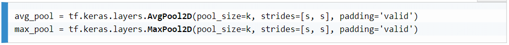

# Modern Neural Networks
## Convolutional Neural Networks
CNNs were introduced to solve some of the shortcomings of the original neural networks. In this section, we will address these issues and present how CNNs deal with them.

#### Problems with fully connected networks
We have already highlighted the following two main drawbacks of basic networks when dealing with images:
- <strong>An explosive number of parameters</strong>: Images are complex structures with a large number of values. Even the small, single-channel images of the MINST dataset represent input vectors of 784 values each. For the first layer of the basic neural network we implemented, this meant a weight matrix of shape (784, 64). This equates to 50,176 (784 × 64) parameter values to optimize, just for this variable! This number of parameters simply explodes when we consider larger RGB images or deeper networks.

- <strong>A lack of spatial reasoning</strong>: Because their neurons receive all the values from the previous layer without any distinction (they are fully connected), these neural networks do not have a notion of distance/spatiality. Spatial relations in the data are lost. More precisely, this means that the notion of proximity between pixels is lost to fully connected (FC) layers, as all pixel values are combined by the layers with no regard for their original positions. Intuitively, neural layers would be much smarter if they could take into account spatial information.

#### Introducing CNNs
First of all, CNNs can handle multidimensional data. For images, a CNN takes as input three-dimensional data (height × width × depth) and has its own neurons arranged in a similar volume. 

This leads to the second novelty of CNNs—unlike fully connected networks, where neurons are connected to all elements from the previous layer, each neuron in CNNs only has access to some elements in the neighboring region of the previous layer. This region is called the receptive field of the neurons (or the filter size).

By linking neurons only to their neighboring ones in the previous layer, CNNs not only drastically reduce the number of parameters to train, but also preserve the localization of image features.

#### Convolution layers
In these layers, the number of parameters is further reduced by sharing the same weights and bias among all neurons connected to the same output channel. 

These specific neurons with shared weights and bias can also be thought of as a single neuron sliding over the whole input matrix with spatially limited connectivity. At each step, this neuron is only spatially connected to the local region in the input volume (H × W × D) it is currently sliding over. Given this limited input of dimensions, the neuron still works like the ones modeled in our first chapter—it linearly combines the input values before applying an activation function to the sum (a linear or non-linear function).

Therefore, the results of a convolution are indeed obtained by sliding a filter, w, over the input matrix, x, and computing, at each position, the dot product of the filter and the patch of x starting at the current position.

Note: the input, x, has been padded with zeros, which is commonly done in convolutional layers.

A convolutional layer with N sets of different neurons is thus defined by N weight matrices (also called filters or kernels) of shape D × k × k (when the filters are square), and N bias values. Therefore, this layer only has N × (Dk2 + 1) values to train - significantly less tan the number of trainable parameters of fully connected layers. i.e. FC layers are influenced by the dimensionality of the data, whereas CNNs are not. 

This property makes convolutional layers really powerful tools in computer vision for two reasons:
- We can train networks for larger input images without impacting the number of parameters we would need to tune. 
- Convolutional layers can be applied to any images, irrespective of their dimensions! Unlike networks with fully connected layers, purely convolutional ones do not need to be adapted and retrained for inputs of different sizes. 

Other interesting properties of convolutional layers include:
- The layer's filters become really good at reacting to specific local features (a layer with N filters means the possibility to react to N different features). Each kernel of the first convolutional layer in a CNN would, for instance, learn to activate for a specific low-level feature, such as a specific line orientation or color gradient. Then, deeper layers would use these results to localize more abstract/advanced features, such as the shape of a face, and the contours of a particular object. 
- Each filter would respond to a specific image feature, whatever its location(s) in the image. More formally, convolutional layers are invariant to translation in the image coordinate space.

Concolutional layer hyperparameters:
- Number of filters, N
- Input depth, D
- Filter/kernel size (kH, kW). As square filters are commonly used, the size is usually simply defined by k.
- Stride: Defines whether the dot product between the image patches and the filters should be computed at every position when sliding (stride = 1), or every s position (stride = s). The larger the stride, the sparser the resulting feature maps.
- Padding: Images can also be zero-padded before convolution; that is, their sizes can be synthetically increased by adding rows and columns of zeros around their original content.

All these parameters not only affect the layer's operations, but also its output shape. As such, with these hyperparameters, we can easily control the layer's output sizes. This is particularly convenient for applications such as object segmentation; that is, when we want the output segmentation mask to be the same size as the input image.

the Keras API encapsulates the initialization of CNNs in the <em>tf.keras.layers</em> module. We can instantiate a similar convolutional layer in a single call, as follows:

The documentation has a long list of additional parameters, encapsulating several concepts, such as weight regularization.

#### Pooling layers 
These pooling layers are a bit peculiar because they do not have any trainable parameters. Each neuron simply takes the values in its window (the receptive field) and returns a single output, computed from a predefined function.

Pooling layers are commonly used with a stride value equal to the size of their window/kernel size, in order to apply the pooling function over non-overlapping patches. Their purpose is to reduce the spatial dimensionality of the data, cutting down the total number of parameters needed in the network, as well as its computation time. Also, as with convolutional layers, you can pad the tensors before applying the operation. Through the padding and stride parameters, it is thus possible to control the dimensions of the resulting tensors.

The two most common pooling methods are max-pooling and average-pooling. <em>Max-pooling</em> layers return only the maximum value at each depth of the pooled area, and <em>average-pooling</em> layers compute the average at each depth of the pooled area.

Max pooling:

With hyperparameters being similar to convolutional layers except for the absence of trainable kernels, pooling layers are, therefore, easy to use and lightweight solutions for controlling data dimensionality. An example of average pooling:

We can instantiate pooling layers in TensorFlow via <em>tf.keras.layers.AvgPool2D</em>:

#### Fully connected layers

FC layers are also used in CNNs, the same way they are in regular networks. However, the input tensors passed to these layers must first be reshaped into a batched column vector — the way we did with the MNIST images for our simple network in Chapter 1.

While it can be advantageous in some cases for neurons to have access to the complete input map, fully connected layers have several shortcomings (for example, the loss of spatial information and the large number of parameters). Moreover, unlike other CNN layers, dense ones are defined by their input and output sizes. A specific dense layer will not work for inputs that have a shape different from the one it was configured for. Therefore, using FC layers in a neural network usually means losing the possibility to apply them to images of heterogeneous sizes.

Despite these shortcomings, these layers are still commonly used in CNNs. They are usually found among the final layers of a network, for instance, to convert the multidimensional features into a 1D classification vector.

Remember that you should, however, take care of flattening the multidimensional tensors before passing them to dense layers. <em>tf.keras.layers.Flatten()</em> can be used as an intermediate layer for that purpose.

#### Effective receptive field
The effective receptive field (ERF) of a neural network is an important notion in deep learning, as it may affect the ability of the network to cross-reference and combine distant elements in the input images.

While the receptive field represents the local region of the previous layer that a neuron is connected to, the ERF defines the region of the input image (and not just of the previous layer), which affects the activation of a neuron for a given layer.

The ERF of a network is directly affected by the number of intermediary layers, their filter sizes, and the strides. Subsampling layers, such as pooling layers or layers with larger strides, greatly increase the ERF at the cost of lower feature resolution.

<strong>Because of the local connectivity of CNNs, you should keep in mind how layers and their hyperparameters will affect the flow of visual information across the networks when defining their architecture.</strong>

## Refining the Training Process

