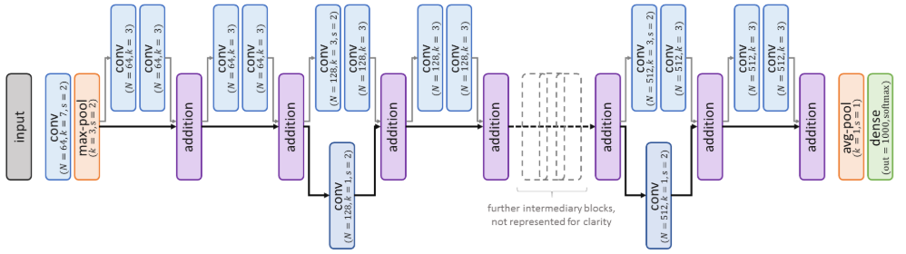
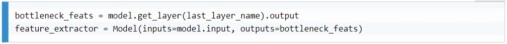

# Influential Classification Tools
After the deep learning breakthrough in 2012, research toward more refined classification systems based on convolutional neural networks (CNNs) gained momentum. 

Among the numerous solutions developed over the years for object classification, some have became famous for their contributions to computer vision. They have been derived and adapted for so many different applications that they have achieved must-know status, and so deserve their own chapter.

## Understanding advanced CNN architectures
In this section, we will present some of the classic deep learning methods, covering the reasons leading to their development and the contributions they made.

#### AlexNet
In 2012, AlexNet was a game changer, being the first CNN successfully trained for such a complex recognition task and making several contributions that are still valid nowadays, such as the following:
- The use of a <strong>rectified linear unit (ReLU)</strong> as an activation function, which prevents the vanishing gradient problem, and thus improving training (compared to using sigmoid or tanh).
- The application of <strong>dropout</strong> to CNNs, thus reaping all their benefits.
- The <strong>typical CNN architecture</strong> combining blocks of convolution and pooling layers, with dense layers afterward for the final prediction.
- The application of <strong>random transformations</strong> (image translation, horizontal flipping, and more) to synthetically augment the dataset.

#### VGG – a standard CNN architecture
Despite the success of AlexNet, it was clear, even back then, that this prototype architecture had room for improvement. At the time, the main motivation of many researchers was to try go deeper), despite the challenges arising from this.

VGG, developed by the Visual Geometry Group from Oxford University, tackled this challenge with success. Though the group only achieved second place in the ILSVRC classification task in 2014, their method influenced many later architectures.

The paper that describes this model presented how they developed their network to be deeper than most previous ones. They actually introduced six different CNN architectures, from 11 to 25 layers deep. 

All the convolutional and max-pooling layers have SAME for padding. The convolutions have s=1 for stride, and are using the ReLU function for activation. All in all, a typical VGG network is represented in the following diagram:

The two most performant architectures, still commonly used nowadays, are called VGG-16 and VGG-19. The numbers (16 and 19) represent the depth of these CNN architectures. VGG-16 has approximately 138 million parameters, and VGG-19 has 144 million. Those numbers are quite high, although, as we will demonstrate in the following section, the VGG researchers took a new approach to keep these values in check despite the depth of their architecture:

- <strong>Replacing large convolutions with multiple smaller ones</strong>: The authors began with a simple observation—a stack of two convolutions with 3 × 3 kernels has the same receptive field as a convolution with 5 × 5 kernels. Similarly, three consecutive 3 × 3 convolutions result in a 7 × 7 receptive field, and five 3 × 3 operations result in an 11 × 11 receptive field. Therefore, while AlexNet has large filters (up to 11 × 11), the VGG network contains more numerous but smaller convolutions for a larger ERF. The benefits of this change are twofold:

    1) It decreases the number of parameters.
    2) It increases the non-linearity. Having a larger number of convolution layers — each followed by a non-linear activation function such as ReLU — increases the networks' capacity to learn complex features.

    Overall, replacing larger convolutions with small, consecutive ones allowed the VGG authors to effectively go deeper.

- <strong>Increasing the depth of the feature maps</strong>: The VGG authors doubled the depth of the feature maps for each block of convolutions (from 64 after the first convolution to 512). As each set is followed by a max-pooling layer with a 2 × 2 window size and a stride of 2, the depth doubles while the spatial dimensions are halved. This allows the encoding of spatial information into more and more complex and discriminative features for classification.

- <strong>Augmenting data with scale jittering</strong>: At each training iteration, they randomly scale the batched images (from 256 pixels to 512 pixels for their smaller side) before cropping them to the proper input size (224 × 224 for their ILSVRC submission). With this random transformation, the network will be confronted with samples with different scales and will learn to properly classify them despite this scale jittering. The network becomes more robust as a result, as it is trained on images covering a larger range of realistic transformations:

    

- <strong>Replacing fully connected layers with convolutions</strong>: While the classic VGG architecture ends with several fully connected (FC) layers (such as AlexNet), the authors suggest an alternative version. In this version, the dense layers are replaced by convolutional ones. Such a network without any dense layers is called a fully convolutional network (FCN). These FCNs have an advantage that they can be applied to images of different sizes, with no need for cropping beforehand.

#### GoogLeNet and the inception module
Developed by researchers at Google, the architecture we will now present was also applied to ILSVRC 2014 and won first place for the classification task ahead of VGGNet.

GoogLeNet (for Google and LeNet, as an homage to this pioneering network) is structurally very different from its linear challenger. They approached the conception of a more efficient CNN from a very different angle than the VGG researchers, by introducing the notion of inception blocks (the network is also commonly called an inception network). 

In spite of the careful engineering of the VGG network,  the deeper CNNs are, the larger their number of trainable parameters. For instance, VGG-16 weighs approximately 93 MB (in terms of parameter storage), and the VGG submission for ILSVRC took two to three weeks to train on four GPUs. With approximately 5 million parameters, GoogLeNet is 12 times lighter than AlexNet and 21 times lighter than VGG-16, and the network was trained within a week. As a result, GoogLeNet—and more recent inception networks—can even run on more modest machines (such as smartphones), which contributed to their lasting popularity.

Despite this impressive reduction in the numbers of parameters and operations, GoogLeNet did win the classification challenge in 2014 with a top-5 error of 6.7% (against 7.3% with VGG). This performance is the result of the second target of Szegedy and others—the conception of a network that was not only deeper but also larger, with blocks of parallel layers for multiscale processing.

The intuition behind it is simple. Building a CNN is a complex, iterative task. How do we know which layer (such as convolutional or pooling) should be added to the stack in order to improve the accuracy? How do we know which kernel size would work best for a given layer? After all, kernels of different sizes will not react to features of the same scale. How can we avoid such a trade-off? A solution, according to the authors, is to use the inception modules they developed, composed of several different layers working in parallel.

As shown in the image below, the GoogLeNet architecture is not as straightforward as the VGG architecture, but it can be analyzed region by region.

The input images are first processed by a classic series of convolutional and max-pooling layers. Then, the information goes through a stack of nine inception modules. These modules (often called subnetworks), are blocks of layers stacked vertically and horizontally. For each module, the input feature maps are passed to four parallel sub-blocks composed of one or two different layers (convolutions with different kernel sizes and max-pooling). The results of these four parallel operations are then concatenated together along the depth dimension and into a single feature volume. 

In the preceding figure, all the convolutional and max-pooling layers have SAME for padding. The convolutions have s=1 for stride if unspecified and are using the ReLU function for activation.

In total, GoogLeNet is a 22-layer deep architecture (counting the trainable layers only), with a total of more than 60 convolutional and FC layers. And yet, this much larger network has 12 times fewer parameters than AlexNet.

The low number of parameters, as well as the network's performance, are the results of several concepts implemented by the GoogLeNet authors. The main ones include: 

- <strong>Capturing various details with inception modules</strong>: The basic inception modules they developed are composed of four parallel layers — three convolutions with filters of size 1 × 1, 3 × 3, and 5 × 5, respectively, and one max-pooling layer with stride=1. The advantages of this parallel processing, with the results concatenated together after, are numerous:

    - This architecture allows for the multiscale processing of the data. i.e. We do not have to choose which kernel size may be the best (such a choice would require several iterations of training and testing cycles), that is, the network learns by itself which convolutions to rely on more for each module.

        Additionally, while we presented how vertically stacking layers with non-linear activation functions positively affects a network's performance, this is also true for horizontal combinations. The concatenation of features mapped from different layers further adds to the non-linearity of the CNN.
    
- <strong>Using 1 x 1 convolutions as bottlenecks</strong>: As previously mentioned, 1 × 1 convolutional layers (with a stride of 1) are often used to change the overall depth of input volumes without affecting their spatial structures. Such a layer with N filters would take an input of shape H × W × D and return an interpolated H × W × N tensor. For each pixel in the input image, its D channel values will be interpolated by the layer (according to its filter weights) into N channel values.

    This property can be applied to reduce the number of parameters required for larger convolutions by compressing the features' depth beforehand (using N < D). This technique basically uses 1 × 1 convolutions as bottlenecks (that is, as intermediary layers reducing the dimensionality and, thus, the number of parameters). 

    Since activations in neural networks are often redundant or left unused, such bottlenecks usually barely affect the performance (as long as they do not drastically reduce the depth). Moreover, GoogLeNet has its parallel layers to compensate for the depth reduction.

    Indeed, in inception networks, bottlenecks are present in every module, before all larger convolutions and after max-pooling operations.

    For example, given the 5 × 5 convolution in the first inception module (taking as input a 28 × 28 × 192 volume), the tensor containing its filters would be of the dimension 5 × 5 × 192 × 32 in the naive version. This represents 153,600 parameters just for this convolution. In the first version of the inception module (with bottlenecks), a 1 × 1 convolution is introduced before the 5 × 5 one, with N = 16. As a result, the two convolutions require a total of 1 × 1 × 192 × 16 + 5 × 5 × 16 × 32 = 15,872 trainable values for their kernels. This is 10 times fewer parameters than the previous version (just for this single 5 × 5 layer), for the same output size!
    
- <strong>Pooling instead of fully connecting</strong>: Another solution used by the inception authors to reduce the number of parameters was to use an average-pooling layer instead of a fully connected one after the last convolutional block. With a 7 × 7 window size and stride of 1, this layer reduces the feature volume from 7 × 7 × 1,024 to 1 × 1 × 1,024 without any parameter to train. A dense layer would have added (7 × 7 × 1,024) × 1,024 = 51,380,224 parameters.

    Though the network loses a bit in expressiveness with this replacement, the computational gain is enormous (and the network already contains enough non-linear operations to capture the information it needs for the final prediction).

    Note: The last and only FC layer in GoogLeNet has 1,024 × 1,000 = 1,024,000 parameters, a fifth of the total number the network has!

- <strong>Fighting vanishing gradient with intermediary losses</strong>: GoogLeNet has two auxiliary branches at training time (removed after), also leading to predictions. Their purpose is to improve the propagation of the loss through the network during training. Indeed, deeper CNNs are often plagued with vanishing gradient. 

    The down-to-earth, yet effective, solution to this problem implemented here is to reduce the distance between the first layers and predictions, by introducing additional classification losses at various network depths. If the gradient from the final loss cannot flow properly to the first layers, these will still be trained to help with classification thanks to the closer intermediary losses. Incidentally, this solution also slightly improves the robustness of the layers affected by multiple losses, as they must learn to extract discriminative features that are not only useful to the main network, but also to the shorter branches.

#### ResNet – the residual network
Inception networks demonstrated that going larger is a valid strategy in image classification, as well as other recognition tasks. Nevertheless, experts still kept trying to increase networks in order to solve more and more complex tasks. However, the question <em>Is learning better networks as easy as stacking more layers?</em>, is justified.

We know already that the deeper a network goes, the harder it becomes to train it. But besides the vanishing/exploding gradient problems, another problem that deeper CNNs face is performance degradation.

It all started with a simple observation — the accuracy of CNNs does not linearly increase with the addition of new layers. A degradation problem appears as the networks' depth increases. Accuracy starts saturating and even degrading. Even the training loss starts decreasing when negligently stacking too many layers, proving that the problem is not caused by overfitting.

For instance, the authors compared the accuracy of an 18-layer-deep CNN with a 34-layer one, showing that the latter performs worse than the shallower version during and after training. In their paper, He et al. proposed a solution to build very deep and performant networks.

This solution came in the form of ResNet, winner of the 2015 edition of ILSVRC. Composed of a new kind of module, the residual module, ResNet (residual network) provides an efficient approach to creating very deep networks, beating larger models such as Inception in terms of performance.

Like Inception, ResNet has known several iterative improvements to its architecture, for instance, with the addition of bottleneck convolutions or the use of smaller kernels. Like VGG, ResNet also has several pseudo-standardized versions characterized by their depth: ResNet-18, ResNet-50, ResNet-101, ResNet-152, and others. Indeed, the winning ResNet network for ILSVRC 2015 vertically stacked 152 trainable layers (with a total of 60 million parameters), which was an impressive feat at that time:

In the preceding diagram, all the convolutional and max-pooling layers have SAME for padding, and for stride s = 1 if unspecified. Batch normalization is applied after each 3 × 3 convolution (on the residual path, in gray), and 1 × 1 convolutions (on the mapping path in black) have no activation function (identity).

The ResNet architecture is slimmer than the Inception architecture, though it is similarly composed of layer blocks with parallel operations. Unlike Inception, where each parallel layer non-linearly processes the input information, ResNet blocks are composed of one non-linear path, and one identity path. The former (represented by the thinner gray arrows) applies a couple of convolutions with batch normalization and ReLU activation to the input feature maps. The latter (represented by the thicker black arrows) simply forward the features without applying any transformation.

As in inception modules, the feature maps from each branch (that is, the transformed features and the original ones) are merged together before being passed to the next block. Unlike inception modules, however, this merging is not performed through depth concatenation, but through element-wise addition (a simple operation that does not require any additional parameters).

Finally, the features from the last block are average-pooled and densely converted into predictions, as in GoogLeNet. 

Residual blocks have been a significant contribution to machine learning and computer vision. These contributions include:

- <strong>Estimating a residual function instead of a mapping</strong>: As the ResNet authors pointed out, the degradation phenomenon would not happen if layers could easily learn identity mapping (that is, if a set of layers could learn weights so that their series of operations finally return the same tensors as the input layers).

    Indeed, the authors argue that, when adding some layers on top of a CNN, we should at least obtain the same training/validation errors if these additional layers were able to converge to the identity function. They would learn to at least pass the result of the original network without degrading it. Since that is not the case—as we can often observe a degradation—it means that identity mapping is not easy to learn for CNN layers. This led to the idea of introducing residual blocks, with two paths:

        - One path further processes the data with some additional convolutional layers

        - One path performs the identity mapping (that is, forwarding the data with no changes)

    We may intuitively grasp how this can solve the degradation problem. When adding a residual block on top of a CNN, its original performance can at least be preserved by setting the weights of the processing branch to zero, leaving only the predefined identity mapping. The processing path will only be considered if it benefits loss minimization.

    The data forwarding path is usually called skip or shortcut. The processing one is commonly called residual path, since the output of its operations is then added to the original input, with the magnitude of the processed tensor being much smaller than the input one when the identity mapping is close to optimal (hence, the term residual). Overall, this residual path only introduces small changes to the input data, making it possible to forward patterns to deeper layers.

- <strong>Going ultra-deep</strong>: It is also worth noting that residual blocks do not contain more parameters than traditional ones, as the skip and addition operations do not require any. They can, therefore, be efficiently used as building blocks for ultra-deep networks. 

    Besides the 152-layer network applied to the ImageNet challenge, the authors illustrated their contributions by training an impressive 1,202-layer one. They reported no difficulty training such a massive CNN (although its validation accuracy was slightly lower than for the 152-layer network, allegedly because of overfitting).

    More recent works have been exploring the use of residual computations to build deeper and more efficient networks, such as Highway networks (with a trainable switch value to decide which path should be used for each residual block) or DenseNet models (adding further skip connections between blocks).

#### Closing remarks on Architecture
The list of CNN architectures presented here does not pretend to be exhaustive. It has been curated to cover solutions both instrumental to the computer vision domain and of pedagogical value. 

As research in visual recognition keeps moving forward at a fast pace, more advanced architectures are being proposed, building upon previous solutions (as Highway and DenseNet methods do for ResNet, for instance), merging them (as with the Inception-ResNet solution), or optimizing them for particular use cases (such as the lighter MobileNet, which was made to run on smartphones). It is, therefore, always a good idea to check what the state of the art has to offer (for example, on official repositories or research journals) before trying to reinvent the wheel.

## Transfer Learning

Most machine learning systems have been designed, so far, for single, specific tasks. Directly applying a trained model to a different dataset would yield poor results, especially if the data samples do not share the same semantic content (for instance, MNIST digit images versus ImageNet photographs) or the same image quality/distribution (for instance, a dataset of smartphone pictures versus a dataset of high-quality pictures). As CNNs are trained to extract and interpret specific features, their performance will be compromised if the feature distribution changes. Therefore, some transformations are necessary to apply networks to new tasks.

Transfer learning is one solution, and has been defined as the situation where what has been learned in one setting is exploited to improve generalization in another setting.

It makes sense for researchers to suppose that, for example, some of the features a CNN is extracting to classify hand-written digits could be partially reused for the classification of hand-written texts. Similarly, a network that learned to detect human faces could be partially repurposed for the evaluation of facial expressions.

Transfer learning is especially interesting when not enough data is available to properly learn the new task (that is, there are not enough image samples to estimate the distribution). .

#### Transferring CNN knowledge

Artificial neural networks have one advantage over human brains that facilitates this operation: they can be easily stored and duplicated.

Transfer learning for CNNs mostly consists of reusing the complete or partial architecture and weights of a performant network trained on a rich dataset to instantiate a new model for a different task. From this conditioned instantiation, the new model can then be fine-tuned; that is, it can be further trained on the available data for the new task/domain.

As we highlighted in the previous chapters, the first layers of a network tend to extract low-level features, whereas final convolutional layers react to more complex notions. For classification tasks, the final pooling and/or fully connected layers then process these high-level feature maps to make their class predictions.

This typical setup and related observations led to various transfer learning strategies. Pretrained CNNs, with their final prediction layers removed, started being used as efficient <strong>feature extractors</strong>. These features can then be processed by one or two new dense layers, which are trained to output the task-related predictions. 

To preserve the quality of the extracted features, the layers of the feature extractors are often frozen during this training phase; that is, their parameters are not updated during the gradient descent. In other cases, when the tasks/domains are less similar, some of the last layers of the feature extractors—or all of them—are fine-tuned; that is, trained along with the new prediction layers on the task data.

#### Use cases

- <strong>Similar tasks with limited training data</strong>: Transfer learning is especially useful when you want to solve a particular task and do not have enough training samples to properly train a performant model, but do have access to a larger and similar training dataset.

    The model can be pretrained on this larger dataset until convergence (or, if available and pertinent, we can fetch an available pretrained model). Then, its final layers should be removed (when the target task is different, that is, its output differs from the pretraining task) and replaced with layers adapted to the target task.

    The new model can finally be prepared for its task by freezing the pretrained layers and by training only the dense ones on top. Since the target training dataset is too small, the model would end up overfitting if we do not freeze its feature extractor component. By fixing these parameters, we make sure that the network keeps the expressiveness it developed on the richer dataset.

-<strong>Similar tasks with abundant training data</strong>: If we have access to a rich enough training set for our application, does it even make sense to use a pretrained model? This question is legitimate if the similarity between the original and target tasks is too low. Pretraining a model, or even downloading pretrained weights, can be costly. However, researchers demonstrated through various experiments that, in most cases, it is better to initialize a network with pretrained weights (even from a dissimilar use case) than with random ones.

-<strong>Dissimilar tasks with limited training data</strong>: In this case, would transfer learning still make sense? In some cases, we can still benefit from transfer learning if we keep in mind that the first layers of CNNs react to low-level features. Instead of only removing the final prediction layers of a pretrained model, we can also remove some of the last convolutional blocks, which are too task-specific. A shallow classifier can then be added on top of the remaining layers, and the new model can finally be fine-tuned.

## Transfer learning in TensorFlow

#### Managing layers

For Sequential models, the list of layers is accessible through the <em>model.layers</em> attribute. This structure has a <em>pop()</em> method, which removes the last layer of the model.

In pure TensorFlow, editing an operational graph supporting a model is neither simple nor recommended. Therefore, instead of removing layers, we simply need to pinpoint the last layer/operation of the previous model we want to keep. Keras provides additional methods to simplify this process. Knowing the name of the last layer to keep (for instance, after printing the names with model.summary()), a feature extractor model can be built in a couple of lines: 

Adding new prediction layers on top of a feature extractor is straightforward, as it is just a matter of adding new layers on top of the corresponding model. For example, this can be done as follows, using the Keras API:

#### Selective training

Transfer learning makes the training phase a bit more complex because we should first restore the pretrained layers and define which ones should be frozen. With Keras, we can simply restore the pretrained model before its transformation for the new task:

Also, in Keras, layers have a <em>.trainable</em> attribute, which can simply be set to False in order to freeze them:

