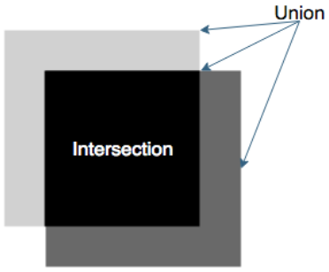

# Object Detection Models
This section will cover the architectures of two prevalent models among the current state of the art for object detection:

1. You Only Look Once (YOLO)
2. Regions with Convolutional Neural Networks (R-CNN)

## Object detection overview
Object detection, also called object localization, is the process of detecting objects and their bounding boxes in an image. A bounding box is the smallest rectangle of an image that fully contains an object.

A common input for an object detection algorithm is an image. A common output is a list of bounding boxes and object classes. For each bounding box, the model outputs the corresponding predicted class and its confidence.

#### Brief history

Historically, object detection relied on a classical computer vision technique: <strong>image descriptors</strong>. To detect an object, for instance, a bike, you would start with several pictures of this object. Descriptors corresponding to the bike would be extracted from the image. To locate the bike in the image, the most commonly used technique was the floating window. Small rectangular areas of the images are examined, one after the other. The part with the most matching descriptors would be considered to be the one containing the object. 

This technique presented a few advantages: it was robust to rotation and color changes, it did not require a lot of training data, and it worked with most objects. However, the level of accuracy was not satisfactory.

#### Measuring performance
An algorithm's performance can be based on how good the algorithm is at the following things:

- Bounding box precision: Providing the correct bounding box
- Recall: Finding all the objects
- Class precision: Outputting the correct class for each object

Common evaluation metrics include:

- Percision and recall: While they are usually not used to evaluate object detection models, precision and recall serve as a basis to compute other metrics.

- Precision-recall curve: The general idea is to visualize the precision and the recall of the model at each threshold of confidence. With every bounding box, our model will output a confidence—a number between 0 and 1 characterizing how confident the model is that a prediction is correct. Because we do not want to keep the less confident predictions, we usually remove those below a certain threshold. Moving the threshold has an impact on precision and on recall. By computing the precision and the recall at each threshold value between 0 and 1, we can obtain a precision-recall curve, as shown here:

    

- <strong>Average precision</strong>:  While the precision-recall curve can tell us a lot about the model, it is often more convenient to have a single number. Average precision (AP) corresponds to the area under the curve. Since it is always contained in a one-by-one rectangle, AP is always between 0 and 1. 

- <strong>Mean average precision</strong>: Average precision gives information about the performance of a model for a single class. To get a global score, we use mean Average Precision (mAP). This corresponds to the mean of the average precision for each class. If the dataset has 10 classes, we will compute the average precision for each class and take the average of those numbers.

- <strong>Average precision threshold</strong>: For bounding boxes, how do you decide when a prediction and the ground truth are matching? A common metric is the Jaccard index, which measures how well two sets overlap (in our case, the sets of pixels represented by the boxes). This is also known as Intersection over Union (IoU). The ratio will always be between 0 (if the two boxes do not overlap) and 1 (if two boxes overlap completely):

    

## YOLO algorithm
YOLO is one of the fastest object detection algorithms available. The latest version, YOLOv3, can run at more than 170 frames per second (FPS) on a modern GPU for an image size of 256 × 256.

First released in 2015, YOLO outperformed almost all other object detection architectures, both in terms of speed and accuracy. Since then, the architecture has been improved several times:

- <em>You Only Look Once: Unified, real-time object detection (2015)</em>
- <em>YOLO9000: Better, Faster, Stronger (2016)</em>
- <em>YOLOv3: An Incremental Improvement (2018)</em>

The implementation here has been designed to be easy to read and understand. Those who wish to acquire a deep understanding of the architecture can refer to the original papers and the implementation.

#### Strengths and limitation
YOLO is known for its speed. However, it has been recently outperformed in terms of accuracy by Faster R-CNN. Also, due to the way it detects objects, YOLO struggles with smaller objects. For instance, it would have trouble detecting single birds from a flock. 

#### YOLO's main concepts

The core idea of YOLO is this: <strong>reframing object detection as a single regression problem.</strong> i.e. Instead of using a sliding window or another complex technique, we will divide the input into a w × h grid, as represented in this diagram:

For each part of the grid, we will define B bounding boxes. Then, our only task will be to predict the following for each bounding box:

- The center of the box
- The width and height of the box
- The probability that this box contains an object
- The class of said object

Since all those predictions are numbers, we have therefore transformed the object detection problem into a regression problem.

In practice, the concepts used by YOLO are a bit more complex than this. Because the architecture of the model can be quite hard to understand in one go, we will split the model into two parts—inference and training:

- Inference is the process of taking an image input and computing results.
- Training is the process of learning the weights of the model.

#### Inferring with YOLO
Like most image detection models, YOLO is based on a backbone model. The role of this model is to extract meaningful features from the image that will be used by the final layers. This is why the backbone is also called the feature extractor. he general YOLO architecture is depicted here:

The final layer of the backbone outputs a feature volume of size w × h × D, where w × h is the size of the grid and D is the depth of the feature volume. 

YOLO's final layer accepts the feature volume as an input. It is composed of convolutional filters of size 1 × 1. (A convolutional layer of size 1 × 1 can be used to change the depth of the feature volume without affecting its spatial structure)

